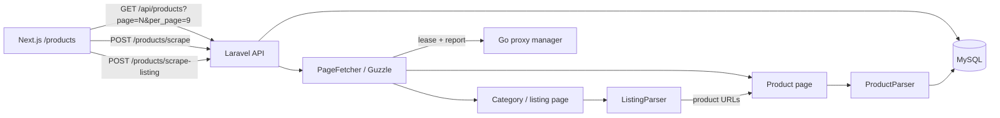
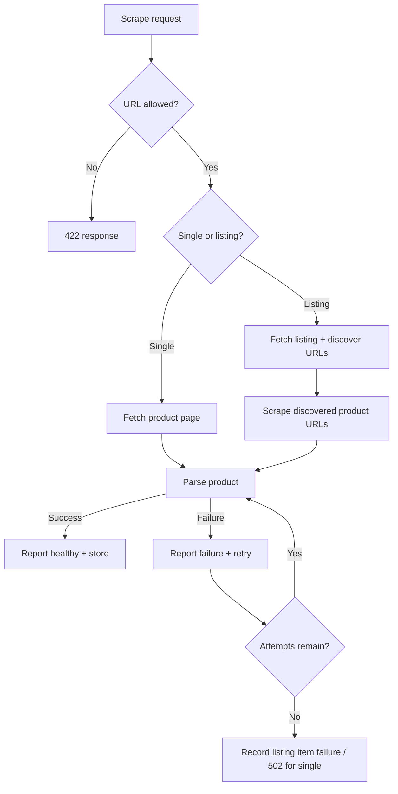

# Architecture and trade-offs

## Runtime flow

The application supports two scrape modes while keeping one product-detail pipeline:

1. **Single product** — a client sends an Amazon or Jumia product URL to `POST /api/products/scrape`.
2. **Category/listing** — a client sends an Amazon or Jumia listing URL to `POST /api/products/scrape-listing` with an optional product `limit` and `max_pages`.
3. Laravel validates the URL shape, scheme, port, credentials, and retailer allowlist before any network request.
4. Laravel leases the next healthy proxy from Go. With an empty pool, Go explicitly returns `direct: true`.
5. `PageFetcher` uses Guzzle with the leased proxy (if present), a rotated browser user agent, bounded redirects, response-size limits, and retry policy. Redirect destinations are checked against the same retailer allowlist.
6. For a product URL, `ProductParser` extracts title, price, and image using retailer-specific selectors followed by Open Graph/product metadata fallbacks.
7. For a listing URL, `ListingParser` discovers product-detail links and an optional next-page link. `ListingScraper` follows pagination only up to the configured bound and then passes each discovered URL through the existing `ProductScraper`.
8. Laravel reports every fetch attempt to Go and stores complete products in MySQL. Exact title/price/image matches are reused during listing imports to avoid obvious duplicate rows.
9. Next.js reads the server-paginated `GET /api/products?page=<n>&per_page=<n>` feed immediately and every 30 seconds. Its on-demand scrape form can trigger either scrape mode; successful scrapes return the UI to the newest first page.



## Component boundaries

| Boundary | Owns | Does not own |
| --- | --- | --- |
| Laravel | Input policy, bounded listing discovery, retries, HTTP requests, parsing, persistence, API representation | Proxy pool health or UI state |
| Go | Round-robin leases, dynamic add/remove, failure threshold, cooldown | Retailer rules, HTML parsing, product persistence |
| Next.js | Product presentation, server-side page navigation, 30-second polling of the current page, on-demand scrape controls, request/error/empty states | Direct retailer requests or database access |
| MySQL | Durable product records | Scheduling or proxy state |

The Go service remains independently testable and proxy credentials stay out of the browser. The Go implementation uses only the standard library, keeping its dependency surface small.

## Listing scrape design

Category pages can contain tens or hundreds of products, so the synchronous trial endpoint is intentionally bounded:

- `SCRAPER_LISTING_DEFAULT_LIMIT=8`
- `SCRAPER_LISTING_MAX_LIMIT=20`
- `SCRAPER_LISTING_DEFAULT_MAX_PAGES=1`
- `SCRAPER_LISTING_MAX_PAGES=5`

The listing parser does **not** duplicate title/price/image extraction. It discovers product URLs only, then reuses `ProductScraper`. That keeps user-agent rotation, proxy selection, URL validation, retries, redirect checks, and product parsing consistent for both modes.

Amazon discovery recognizes product-detail URLs containing `/dp/<ASIN>` or `/gp/product/<ASIN>` and common next-page controls. Jumia discovery recognizes product cards linking to `*.html` product pages and the `Next Page` pagination control.

A high-volume implementation should enqueue each discovered product URL instead of scraping dozens or hundreds of detail pages inside a single HTTP request.


## Stored-product pagination

`GET /api/products` uses Laravel's database paginator rather than loading every product row into memory. The UI requests 9 products per page and the API accepts `page` plus `per_page`, with `per_page` capped at 48. The JSON resource response includes `data`, pagination `links`, and `meta` (`current_page`, `last_page`, `from`, `to`, `per_page`, and `total`).

The frontend renders Previous/Next buttons plus a compact numbered-page window. Changing page triggers a new API request, and the 30-second polling loop refreshes the currently selected page instead of resetting navigation. After a successful scrape, the UI returns to page 1 so newly stored products are immediately visible. This is separate from listing-page traversal: `max_pages` controls how many retailer listing pages the scraper may crawl, while API pagination controls how stored products are presented to the user.

## Failure behavior



- `SCRAPER_MAX_ATTEMPTS` controls bounded fetch retries. Each attempt gets a new user agent and proxy lease.
- A proxy enters cooldown after `PROXY_FAILURE_THRESHOLD` consecutive failures.
- If no proxy is ready, the pool returns a direct lease. Set `PROXY_MANAGER_REQUIRED=true` if direct fallback is unacceptable.
- Listing imports tolerate individual product failures and report them in `errors`; they fail the whole request only when no product can be successfully scraped.
- The frontend retains previously loaded products when a background refresh fails and presents a recoverable alert.

## Security decisions

- Only `http` and `https` URLs on configured retailer domains are accepted.
- URL credentials and ports other than 80/443 are rejected.
- Every redirect destination is revalidated.
- Listing-discovered links are constrained to the same retailer site before they are passed back through the allowlist guard.
- Guzzle timeouts, maximum redirects, response-size limits, API throttling, product limits, and page limits bound resource use.
- The Go bearer token is optional for local evaluation and should be set outside development.
- Proxy URLs are redacted from inventory and add responses. The full credential-bearing URL is returned only by the internal lease endpoint.
- Containers use non-root runtime users for Laravel, Next.js, and Go.

DNS rebinding protection would require resolving and pinning public addresses at the networking layer; the retailer allowlist significantly reduces the trial's SSRF surface but is not a replacement for an egress proxy in a high-security production environment.

## Data model

The schema intentionally follows the task:

```text
products(id, title, price, image_url, created_at)
```

`price` is `DECIMAL(12,2)`, preventing binary floating-point storage errors. Currency is not guessed because the requested model does not include a currency field.

Listing imports use `firstOrCreate` on the exact title/price/image tuple as a lightweight trial-level duplicate guard. In production, add `source_url`, `retailer`, `currency`, and `updated_at`, then upsert on a canonical retailer/source key.

## Scaling path

For higher volume, place listing discovery and product scrape commands on Laravel queues, add per-retailer concurrency/rate limits, persist proxy health in Redis, use an authenticated control plane, monitor selector success rates, and introduce Playwright only for JavaScript-rendered pages that cannot be handled by HTTP HTML parsing.
